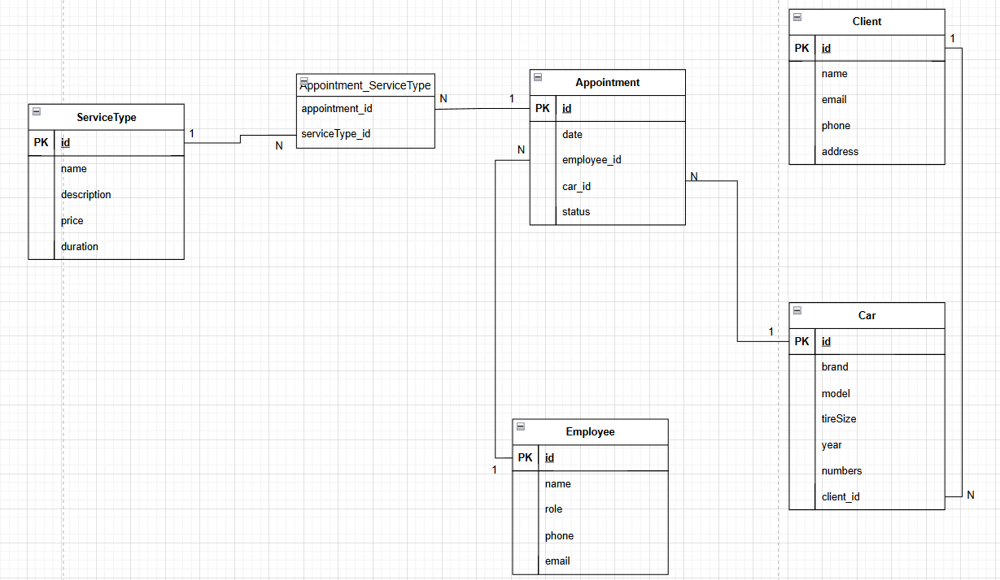

# TireApi

TireApi - это Web API для службы шиномонтажа. Проект построен с использованием .NET Core, архитектурного подхода Repository-Service и Entity Framework Core для работы с базой данных.

# [Тестирование в Postman](https://github.com/w3bber/tireApi/tree/main/assets/postman_screenshots)


## ER-Диаграмма


## 📁 Структура проекта

- **Common/** - Общие классы и утилиты:
  - `ApiResponse.cs` - Класс для стандартных API-ответов.
  - `ResponseHandler.cs` - Обработчик ответов API.
- **Controllers/** - Контроллеры API, обрабатывающие HTTP-запросы.
- **EfCore/** - Конфигурации и настройки для Entity Framework Core.
- **Mappers/** - Маппинг моделей между слоями.
- **Migrations/** - Миграции базы данных.
- **Models/** - Классы моделей, используемые в базе данных.
- **Repositories/** - Реализация паттерна "Repository":
  - `Interfaces/` - Интерфейсы для репозиториев.
  - `AppointmentRepository.cs` - Репозиторий для работы с записями на шиномонтаж.
  - `CarRepository.cs` - Репозиторий для автомобилей клиентов.
  - `ClientRepository.cs` - Репозиторий клиентов.
  - `EmployeeRepository.cs` - Репозиторий сотрудников.
  - `ServiceTypeRepository.cs` - Репозиторий типов услуг.
- **Services/** - Логика бизнес-уровня:
  - `Interfaces/` - Интерфейсы сервисов.
  - `AppointmentService.cs` - Сервис управления записями на шиномонтаж.
  - `CarService.cs` - Сервис управления автомобилями.
  - `ClientService.cs` - Сервис управления клиентами.
  - `EmployeeService.cs` - Сервис управления сотрудниками.
  - `ServiceTypeService.cs` - Сервис управления типами услуг.
- **Конфигурационные файлы:**
  - `appsettings.json` - Настройки приложения.
  - `Program.cs` - Входная точка API.
  - `TireApi.http` - Примеры HTTP-запросов.

## 🚀 Запуск проекта

### 1. Клонирование репозитория
```sh
git clone https://github.com/yourusername/TireApi.git
cd TireApi
```

### 2. Установка зависимостей
```sh
dotnet restore
```

### 3. Настройка базы данных
Убедитесь, что в `appsettings.json` правильно указан connection string.
Затем примените миграции:
```sh
dotnet ef database update
```

### 4. Запуск API
```sh
dotnet run
```

## 🛠 Используемые технологии
- .NET Core Web API
- Entity Framework Core
- Repository-Service паттерн
- PostgreSQL

## 📌 API Эндпоинты

| Метод  | Эндпоинт                 | Описание                     |
|--------|--------------------------|------------------------------|
| GET    | `/api/Client`            | Получить список клиентов     |
| POST   | `/api/Client`            | Создать нового клиента       |
| GET    | `/api/Client/{id}`       | Получить клиента по id       |
| PUT    | `/api/Client/{id}`       | Обновить информацию о клиенте|
| DELETE | `/api/Client/{id}`       | Удалить клиента по id        |
| GET    | `/api/Car`               | Получить список автомобилей  |
| POST   | `/api/Car`               | Добавить новый автомобиль    |
| GET    | `/api/Car/{id}`          | Получить автомобиль по id    |
| PUT    | `/api/Car/{id}`          | Обновить информацию об авто  |
| DELETE | `/api/Car/{id}`          | Удалить автомобиль по id     |
| GET    | `/api/Employee`          | Получить список сотрудников  |
| POST   | `/api/Employee`          | Добавить нового сотрудника   |
| GET    | `/api/Employee/{id}`     | Получить сотрудника по id    |
| PUT    | `/api/Employee/{id}`     | Обновить информацию о сотруднике |
| DELETE | `/api/Employee/{id}`     | Удалить сотрудника по id     |
| GET    | `/api/Appointment`       | Получить список записей      |
| POST   | `/api/Appointment`       | Создать новую запись         |
| GET    | `/api/Appointment/{id}`  | Получить запись по id        |
| PUT    | `/api/Appointment/{id}`  | Обновить запись              |
| DELETE | `/api/Appointment/{id}`  | Удалить запись по id         |
| GET    | `/api/ServiceType`       | Получить список типов услуг  |
| POST   | `/api/ServiceType`       | Добавить новый тип услуги    |
| GET    | `/api/ServiceType/{id}`  | Получить тип услуги по id    |
| PUT    | `/api/ServiceType/{id}`  | Обновить тип услуги          |
| DELETE | `/api/ServiceType/{id}`  | Удалить тип услуги по id     |


